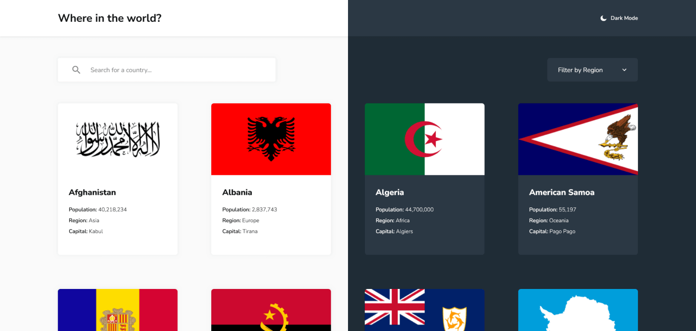

# Frontend Mentor - REST Countries API with color theme switcher solution

This is a solution to the [REST Countries API with color theme switcher challenge on Frontend Mentor](https://www.frontendmentor.io/challenges/rest-countries-api-with-color-theme-switcher-5cacc469fec04111f7b848ca).

## 📃 Table of contents

- [🔎 Overview](#-overview)
  - [The challenge](#the-challenge)
  - [Screenshot](#screenshot)
  - [Links](#links)
- [👨‍🎓 My process](#-my-process)
  - [Project Structure](#project-structure)
  - [Built with](#built-with)
  - [What I learned](#what-i-learned)
    - [Islands Architecture](#islands-architecture)
    - [Static Generation](#static-generation)
    - [View Transitions](#view-transitions)
    - [Sharing State Between Components](#sharing-state-between-components)
- [📖 Useful resources](#useful-resources)
- [😶‍🌫️ Author](#️-author)
- [🧞 Commands](#-commands)

## 🔎 Overview

### The challenge

Users should be able to:

- See all countries from the API on the homepage
- Search for a country using an `input` field
- Filter countries by region
- Click on a country to see more detailed information on a separate page
- Click through to the border countries on the detail page
- Toggle the color scheme between light and dark mode _(optional)_

### Screenshot



### Links

- Solution URL: [https://www.frontendmentor.io/solutions/rest-countries-astro-react-tailwind-ssg-viewtransitions-BiyBi4r0Jz](https://www.frontendmentor.io/solutions/rest-countries-astro-react-tailwind-ssg-viewtransitions-BiyBi4r0Jz)
- Live Site URL: [https://fem-countries-static.netlify.app/](https://fem-countries-static.netlify.app/)

## 👨‍🎓 My process

### Built with

- Semantic HTML5 markup
- Static Site Generation (SSG)
- Astro islands architecture
- Flexbox
- CSS Grid
- Mobile-first workflow
- [Astro](https://astro.build/) - Web framework
- [React](https://reactjs.org/) - JS library
- [Tailwind CSS](https://tailwindcss.com/) - CSS framework
- [Headless UI](https://headlessui.com/) - Tailwind components

### What I learned

This was my first time using Astro, and I really enjoyed it. I was able to build a static site with interactive components.

#### Islands Architecture

The [Islands architecture](https://docs.astro.build/en/concepts/islands/) of Astro was confuse at the beginning, but helped me to understand more about hidration and static generation.

I had to use this architecture (using the `client:load` attribute) to enable the functionality of the search input, region select, and the hydration of the CountriesGrid component.

```jsx
// pages/index.astro

import { CountriesGrid } from "@components/CountriesGrid.jsx";
import { RegionDropdown } from "@components/RegionDropdown";
import { Search } from "@components/Search";

// ...

<Search client:load />
<RegionDropdown client:load />

// ...

<CountriesGrid countries={sortedCountries} client:load />
```

#### Static Generation

For the static generation of the country pages, I used the `getStaticPaths` function, which allowed me to dynamically generate the routes for each country using the [restcountries](https://restcountries.com/) API.

```javascript
// pages/[country].astro

export async function getStaticPaths() {
  const data = await fetch("https://restcountries.com/v3.1/all").then(
    (response) => response.json()
  );

  // ...

  return data.map((country) => {
    // Replace spaces with dashes to create a valid URL
    // e.g. "United States" -> "United-States"
    const countryName = country.name.common.replace(/\s/g, "-");

    return {
      params: {
        country: countryName,
      },
      // ...
    };
  });
}
```

#### View Transitions

Adding View Transitions to the site was very simple, I just had to use the `ViewTransitions` component from `astro:transitions` in the head of the document and add the `transition:animate` attribute to the elements that I wanted to animate.

Using view transitions in Astro allowed me to add transitions between pages that share the same layout, giving a smoother navigation experience.

```jsx
// layouts/Details.astro

import { ViewTransitions } from "astro:transitions";

<html>
  <head>
    <ViewTransitions />
  </head>
</html>;
```

```html
// pages/Details.astro


<h1 transition:animate="slide">
  {country.name.common}
</h1>
```

#### Sharing State Between Components

To share state between components, I used the `nanostores` library recommended by Astro. I created a store to save the current region selected and the search query.

```javascript
// src/store/countriesStore.js

import { atom } from "nanostores";

export const filteredCountries = atom([]);

export const searchQuery = atom("");

export const selectedRegion = atom("");
```

Then I used the `useStore` hook to access the store from any component and the `set` method to update the store. To read more about sharing state between components, check out the [Astro docs](https://docs.astro.build/en/recipes/sharing-state/#_top).

```jsx
// components/Search.jsx

import { useStore } from "@nanostores/react";
import { searchQuery } from "@store/countriesStore.js";

export const Search = () => {
  const $searchQuery = useStore(searchQuery);

  const handleSearch = (e) => {
    searchQuery.set(e.target.value);
  };

  // ...
};
```

## 📖 Useful resources

- [Astro Islands](https://docs.astro.build/en/concepts/islands/#_top) - This helped me to understand the islands architecture of Astro.
- [Share state between Astro Components](https://docs.astro.build/en/recipes/sharing-state/#_top) - This helped me to understand how to share state between components using the `nanostores` library.
- [Aliases](https://docs.astro.build/en/guides/aliases/#_top) - This helped me to understand how to use aliases to import components and assets.
- [Client Directives](https://docs.astro.build/en/reference/directives-reference/#client-directives) - This helped me to understand how to use client directives to enable interactivity in static sites.

## 😶‍🌫️ Author

- Github - [@Javieer57](https://github.com/Javieer57)
- Frontend Mentor - [@Javieer57](https://www.frontendmentor.io/profile/Javieer57)

## 🧞 Commands

All commands are run from the root of the project, from a terminal:

| Command                   | Action                                           |
| :------------------------ | :----------------------------------------------- |
| `npm install`             | Installs dependencies                            |
| `npm run dev`             | Starts local dev server at `localhost:4321`      |
| `npm run build`           | Build your production site to `./dist/`          |
| `npm run preview`         | Preview your build locally, before deploying     |
| `npm run astro ...`       | Run CLI commands like `astro add`, `astro check` |
| `npm run astro -- --help` | Get help using the Astro CLI                     |
